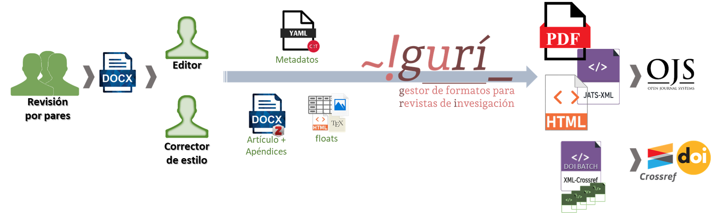

# \~!gurí\_<a href="https://github.com/estedeahora/guri"></a>

## Gestor Unificado de formatos para Revistas de Investigación

<!-- badges: start -->
[](http://creativecommons.org/licenses/by-nc-sa/4.0/) 
<!-- [](https://github.com/estedeahora/guri/blob/main/README.md) -->
[](https://github.com/estedeahora/guri/blob/main/README.en.md) 
<!-- [](https://github.com/jonatasemidio/multilanguage-readme-pattern/blob/master/README.pt-br.md)-->
[](https://www.repostatus.org/#active)
[](https://github.com/estedeahora/guri/actions/workflows/R-CMD-check.yaml)
[](https://estedeahora.r-universe.dev/guri)
<!-- badges: end -->

`~!gurí_` es una propuesta que facilita la etapa de producción editorial de revistas científicas, mediante la generación de documentos finales a partir de documentos obtenidos de la etapa de 'revisión de pares' en formato `docx`. Para ello, esta propuesta se centra en el paquete de R `{guri}`, el cual se encarga de coordinar el proceso de generación de los documentos finales en diferentes formatos. 

Esta propuesta busca resolver las dificultades que atraviesan algunas revistas académicas de acceso diamante para la generación de documentos finales en diferentes formatos de forma consistente, evitando procesos duplicados y altos costos editoriales. Además, toma en cuenta que muchas revistas científicas utilizan como base de sus flujos de trabajos documentos `docx`. <!--  La propuesta surgió como respuesta a la dificultad de las revistas académcias de acceso diamante para generar los documentos finales del proceso de publicación sin aumentar los costos de publicación. -->

La propuesta propone esquematizar y separar los principales elementos que componen un artículo científico. Para ello, para cada artículo, se debe generar un archivo `docx` (generado mediante una plantilla predefinida y con las citas identificadas con Zotero) y un archivo `yaml` con los metadatos del artículo. Opcionalmente, puede brindarse otros archivos con información de la [taxonomía CRediT](https://credit.niso.org/), elementos flotantes (figuras y tablas) y apéndices. A partir de estos archivos iniciales se genera un archivo intermedio `markdown`, que se utiliza para generar los documentos finales (en formato `pdf`, `html` y `xml`). Además, esta herramienta permite generar un archivo xml para el depósito de DOI en Crossref. Por su diseño, la propuesta permite una fuerte adaptación y personalización para que pueda ser adaptado a las particularidades y estética de cada revista.



De forma resumida, podemos señalar que la propuesta de \~`!gurí_` se compone de dos aspectos que trabajan de forma coordinada: un flujo de trabajo y un conjunto de herramientas de programación. Por un lado, la propuesta exige adoptar un *flujo de trabajo*, que incluye una determinada organización de archivos y carpetas, así como el plantillado de los manuscritos siguiendo un conjunto de reglas predefinidas. Por otra parte, la propuesta se basa en un conjunto de *herramientas de programación* que se encargan de la creación de los documentos finales en los diferentes formatos. Gran parte de este trabajo se hace con [Pandoc](https://pandoc.org/), que es utilizado 'debajo del capó' para la conversión entre formatos de marcado. Para adaptar Pandoc a las necesidades de la edición académica, se utilizan un conjunto de filtros *Lua* y *plantillas* personalizadas. Por su parte, [*LaTeX*](https://www.latex-project.org/) se utiliza para generar los archivos en formato `pdf`. Por último, la propuesta utiliza el lenguaje de programación *R* para coordinar y 'envolver' todo el proceso. En términos prácticos, todo este proceso es coordinado por el paquete de *R* `{guri}`. 

## Documentación

Una descripción de la propuesta puede encontrarse en la [documentación](https://estedeahora.github.io/guri/) de usuario.

## Dependencias de software

Para el uso de esta herramienta se requiere tener previamente instalado [R](https://cran.r-project.org/) (recomendable versión 4.3 o superior), siendo recomendable tener instalado el entorno de desarrollo [RStudio](https://posit.co/products/open-source/rstudio/), el cual facilita el trabajo con R. Si bien para el funcionamiento de la propuesta se utilizan otros programas, el paquete de R `{guri}` se encarga de la instalación de estas dependencias (ver `guri_install()`). En este sentido, como parte de la configuración de `{guri}` el paquete instalará [Pandoc](https://pandoc.org/) y una distribución de *LaTeX* denominada [tinytex](https://yihui.org/tinytex/), la cual tiene una robusta integración con R, facilitando la instalación de los paquetes de LaTeX que hicieran falta.[^1]

[^1]: De forma predeterminada se instalarán además los siguientes paquetes de `LaTeX` que son utilizados por la pantilla de Pandoc: [`amsfonts`](https://ctan.org/pkg/amsfonts), [`amsmath`](https://ctan.org/pkg/amsmath), [`lm`](https://ctan.org/pkg/lm), [`unicode-math`](https://ctan.org/pkg/unicode-math), [`iftex`](https://ctan.org/pkg/iftex), [`listings`](https://ctan.org/pkg/listings), [`fancyvrb`](https://ctan.org/pkg/fancyvrb), [`longtable`](https://ctan.org/pkg/longtable), [`booktabs`](https://ctan.org/pkg/booktabs), [`graphicx`](https://ctan.org/pkg/graphicx), [`hyperref`](https://ctan.org/pkg/hyperref), [`xcolor`](https://ctan.org/pkg/xcolor), [`soul`](https://ctan.org/pkg/soul), [`geometry`](https://ctan.org/pkg/geometry), [`setspace`](https://ctan.org/pkg/setspace), [`babel`](https://ctan.org/pkg/babel), [`xeCJK`](https://ctan.org/pkg/xecjk), [`fontspec`](https://ctan.org/pkg/fontspec), [`selnolig`](https://ctan.org/pkg/selnolig), [`mathspec`](https://ctan.org/pkg/mathspec), [`biblatex`](https://ctan.org/pkg/biblatex), [`bibtex`](https://ctan.org/pkg/bibtex), [`biber`](https://ctan.org/pkg/biber), [`upquote`](https://ctan.org/pkg/upquote), [`microtype`](https://ctan.org/pkg/microtype), [`csquotes`](https://ctan.org/pkg/csquotes), [`natbib`](https://ctan.org/pkg/natbib), [`bookmark`](https://ctan.org/pkg/bookmark), [`footnotehyper`](https://ctan.org/pkg/footnotehyper), [`footnote`](https://ctan.org/pkg/footnote), [`xurl`](https://ctan.org/pkg/xurl), [`parskip`](https://ctan.org/pkg/parskip) y [svg](https://ctan.org/pkg/svg). A su vez, la adaptación de la plantilla utiliza los siguientes paquetes: [`adjustbox`](https://ctan.org/pkg/adjustbox), [`fontawesome5`](https://ctan.org/pkg/fontawesome5), [`caption`](https://ctan.org/pkg/caption), [`ccicons`](https://ctan.org/pkg/ccicons), [relsize](https://ctan.org/pkg/relsize), [`truncate`](https://ctan.org/pkg/truncate), [`lastpage`](https://ctan.org/pkg/lastpage) y [`koma-script`](https://ctan.org/pkg/koma-script).

## Instalación

Deberá instalar {guri}. Para esto puede hacerlo desde `r-universe` de la siguiente manera: 

``` r
options(repos = c(
    estedeahora = 'https://estedeahora.r-universe.dev',
    CRAN = 'https://cloud.r-project.org'))
install.packages('guri')
```

También puede hacerlo directamente desde el repositorio github, para lo cual puede utilizar {remotes} o {pak} según usted prefiera.

``` r
# install.packages("remotes")
remotes::install_github("estedeahora/guri")

# or

# install.packages("pak")
pak::pkg_install("estedeahora/guri")
```
Una vez instalado {guri} deberá cargar el paquete e instalar las dependencias externas (Pandoc y Tinytex). Este proceso puede tardar unos minutos y requiere una conexión estable a internet.

``` r
library(guri)
guri_install()
```

## Licencia

*`~!gurí_`* puede usarse como parte del proceso de producción de *revistas de acceso diamante* (revistas sin cobro de cargos de procesamiento y sin muros de pago). Más allá de esta restricción, no existe ningún límite salvo la atribución de autoría. En este sentido, se solicita que si su revista utiliza esta herramienta como parte de su proceso editorial agregue el siguiente texto dentro de su página web (habitualmente dentro de la sección de 'política editorial') en los diferentes idiomas que utilice en la revista:

> *Español:*\
> Los documentos finales de esta revista fueron generados utilizando [\~!guri\_](https://github.com/estedeahora/guri).
>
> *English:*\
> The final documents of this journal were generated using [\~!guri\_](https://github.com/estedeahora/guri).
>
> *Português:*\
> Os documentos finais desta revista foram gerados usando [\~!guri\_](https://github.com/estedeahora/guri).

Esta herramienta está bajo una licencia [Creative Commons Attribution-NonCommercial-ShareAlike 4.0 International License](http://creativecommons.org/licenses/by-nc-sa/4.0/). Este software no ofrece garantía de ningún tipo.

[](http://creativecommons.org/licenses/by-nc-sa/4.0/)

## Contribuir

Se aceptan solicitudes de extracción, informes de errores y solicitudes de funciones. Utilice los [issues](https://github.com/estedeahora/guri/issues) para informar errores o solicitar funciones.

## Futuras mejoras

1.  [x] Transformar funciones en paquete de R.
2.  [x] Permitir filtros personalizados.
3.  [x] Agregar soporte para permitir primer idioma diferente de español.
4.  [x] Permitir salida para depósito DOI en Crossref.
5.  [ ] Desarrollar aplicación web para facilitar la generación de archivos yaml.
6.  [ ] Integrar con OJS.
7.  [ ] Posibilitar uso desde línea de comando (y luego desde aplicación).
8.  [ ] Ofrecer múltiples templates como opción con `guri_make_journal`.
9.  [ ] Agregar ebook como formato de salida.
10.  [ ] Incorporar requerimientos de *Scielo*.
