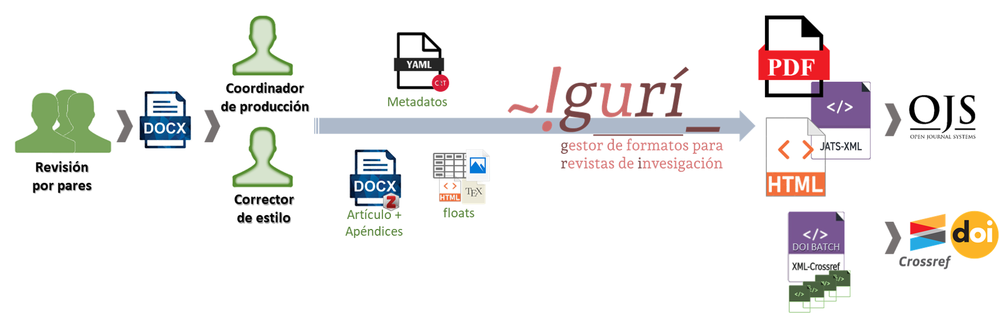

# \~!gurí\_

## Gestor Unificado de formatos para Revistas de Investigación

   <!-- -->

La herramienta `~!gurí_` es un flujo de trabajo y un conjunto de herramientas que facilitan una automatización del proceso de generación de documentos finales para revistas científicas a partir de documentos obtenidos en la etapa de 'corrección de pruebas'. La herramienta se basa en el uso de [Pandoc](https://pandoc.org/) como herramienta de conversión entre formatos, a la cual se incorpora un conjunto de filtros *Lua* y plantillas personalizadas, así como un flujo de trabajo que permite la correcta conversión de los documentos ingresados.

## Documentación

Una descripción de la propuesta puede encontrarse en la [documentación](estedeahora.github.io/guri) de usuario.

## Dependencias

Para el uso de esta herramienta se requiere la instalación de los siguientes programas:

-   [Pandoc](https://pandoc.org/) (versión 3.1.10 o superior);
-   [R](https://cran.r-project.org/) y los paquetes `tidyverse`, `rmarkdown`, `readxl`, `tinytex` y `crayon`;
-   Alguna distribución de *LaTeX*. Se recomienda utilizar [TinyTeX](https://yihui.org/tinytex/) , que fue pensada para utilizarse directamente desde R y facilita gran parte del proceso de instalación de paquetes sin requerir demasiados conocimientos sobre el tema. De hecho esta versión se utiliza de forma predeterminada para la generación de archivos `PDF`.

## Licencia

Esta herramienta puede usarse para la producción de revistas de acceso diamante (sin cobro de cargos de procesamiento y sin muros de pago) sin ningún límite salvo la atribución. En este sentido, se solicita que si su revista utiliza esta herramienta como parte de su proceso editorial agregue el siguiente texto dentro de su página web (habitualmente dentro de la sección de 'política editorial') en los diferentes idiomas que utilice en la revista:

> *Español:*\
> Los documentos finales de esta revista fueron generados utilizando [\~!guri\_](https://github.com/estedeahora/guri).
>
> *English:*\
> The final documents of this journal were generated using [\~!guri\_](https://github.com/estedeahora/guri).
>
> *Português:*\
> Os documentos finais desta revista foram gerados usando [\~!guri\_](https://github.com/estedeahora/guri).

Esta obra está bajo una licencia [Creative Commons Attribution-NonCommercial-ShareAlike 4.0 International License](http://creativecommons.org/licenses/by-nc-sa/4.0/). Este software no ofrece garantía de ningún tipo.

## Contribuir

Se aceptan solicitudes de extracción, informes de errores y solicitudes de funciones.

## Futuras mejoras

1.  [ ] Desarrollar aplicación web para facilitar la generación de archivos yaml.
2.  [ ] Integrar con OJS.
3.  [ ] Posibilitar uso desde línea de comandos (y luego desde aplicación).
4.  [ ] Agregar soporte para permitir primer idioma diferente de español.
5.  [ ] Permitir filtros personalizados.
6.  [ ] Agregar ebook como formato de salida.
7.  [ ] Incorporar requerimientos de *Scielo*.
